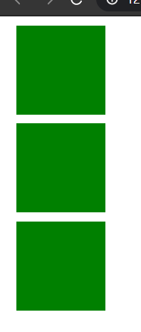
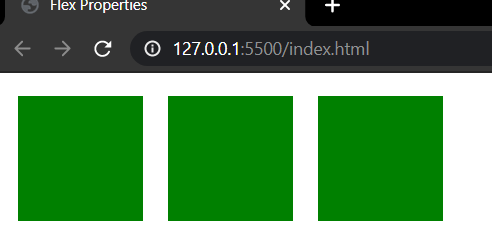
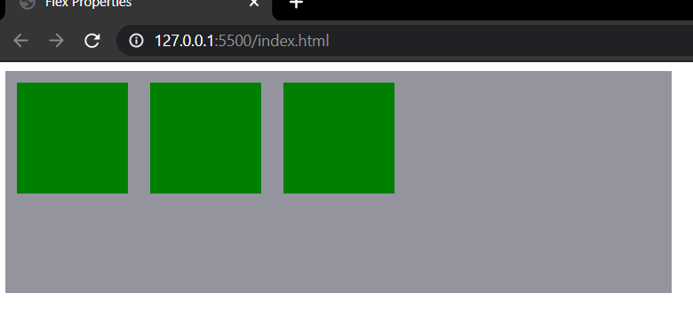
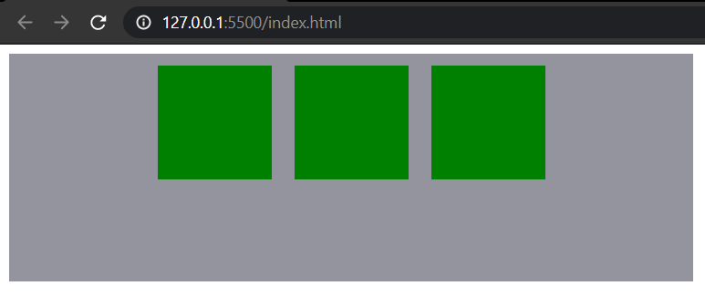
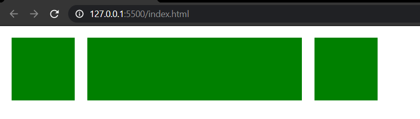

# :computer: **FLEX PROPERTY CODE** :computer:

<br>
<br>


## :star:***For Parent***:star:
<br>


  ## :hammer:**Display Property Code** :hammer:
<br>


```html
<!DOCTYPE html>
<html lang="en">

<head>
    <meta charset="UTF-8">
    <meta name="viewport" content="width=device-width, initial-scale=1.0">
    <title>Flex Properties</title>
    <style>
        .item1,
        .item2,
        .item3 {
            background-color: green;
            width: 100px;
            height: 100px;
            margin: 10px;
        }
        
        .main {
            display: flex;
        }
    </style>

</head>

<body>
    <div class="main">

        <div class="item1"></div>
        <div class="item2"></div>
        <div class="item3"></div>
    </div>

</body>

</html>
```
<br>


 ## **OUTPUT** :wink:
<br>


 ### **Before Applying Display Property** :pen:

 <br>

 

 <br>

<br>

  ### **After Applying Display Property** :pen:

<br>



<br>

<br>

<br>


<br>

<br>

  ## **Justify Content Property Code** :pencil2:

<br>


  ```html
<!DOCTYPE html>
<html lang="en">

<head>
    <meta charset="UTF-8">
    <meta name="viewport" content="width=device-width, initial-scale=1.0">
    <title>Flex Properties</title>
    <style>
        .item1,
        .item2,
        .item3 {
            background-color: green;
            width: 100px;
            height: 100px;
            margin: 10px;
        }
        
        .main {
            display: flex;
            justify-content: center;
            width: 600px;
            height: 200px;
            background-color: rgb(148, 148, 158);
        }
    </style>

</head>

<body>
    <div class="main">

        <div class="item1"></div>
        <div class="item2"></div>
        <div class="item3"></div>
    </div>

</body>

</html>
```

<br>

<br>


 ## **OUTPUT** :wink:

<br>


 ### **Before Applying Justify Content Property** :pen:

 <br>

 

 <br>

<br>

  ### **After Applying Display Property** :pen:

<br>



<br>

<br>

<br>


<br>

<br>

<br>


## :star:***For Child*** :star:

<br>


## :hammer:**Flex-Grow Property Code** :hammer:

<br>


```html
<!DOCTYPE html>
<html lang="en">

<head>
    <meta charset="UTF-8">
    <meta name="viewport" content="width=device-width, initial-scale=1.0">
    <title>Flex Properties</title>
    <style>
        .item1,
        .item2,
        .item3 {
            background-color: green;
            width: 100px;
            height: 100px;
            margin: 10px;
        }
        
        .main {
            display: flex;
            width: 600px;
            height: 200px;
        }
        
        .item2 {
            flex-grow: 3;
        }
    </style>

</head>

<body>
    <div class="main">

        <div class="item1"></div>
        <div class="item2"></div>
        <div class="item3"></div>
    </div>

</body>

</html>
```

<br>
<br>


 ## **OUTPUT** :wink:

<br>


 ### **Before Applying Flex-Grow Property** :frog:

 <br>

 

 <br>

<br>

  ### **After Applying Flex-Grow Property** :frog:

<br>



<br>

<br>

<br>
