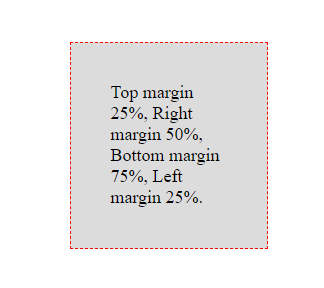

*** 
<details>
  <summary markdown="span"> CSS Topics 📁  </summary>

1. CSS Version History.<a href="Rushikesh_CSS_Vhistory.md">👉</a>
2. External Style Sheet using Multiple Style Sheets.<a href="Rushikesh_CSS_MultipleStyleSheet.md">👉</a>
3. Value Lengths and Percentages.<a href="#value">👇</a>

</details>

***


<p aligh="left">

- CSS Units -
    - value: Length   
      - Absolute Lengths.
      - Relative Lengths
    - value: Percentage.
    
</p>

***

<P align="center" id="value"><b><i>Topic 3 : Value - Length, Percentage</i><b></p>
  
***

✔️ value: Length- 

- CSS has different properties that use length values. 
- length is followed by a unit. there are different types of units in CSS.
  
✔️ Units- 
1. Absolute Length -
   - These are fixed units, displays exactly the same size.
   - Absolute Units.- px,in,cm,mm,pt,pc.
2. Relative Length -
   - Relative lengths are relative to another length property.
   - Relative Units.- em,rem,ex,ch.


📝 Example of Absolute and Relative lengths - 

```html
<style>

h1 {font-size: 60px;}

h2 {font-size: 2em;}


</style>

```

🖊️ Inside HTML body -
```html

<h1>Web</h1>

<h2>Development</h2>

```

📄 Output -

<p align="center" ></p>


>px - 1px = 1/96th of 1 in.
em - Relative to font-size of Element.

***
✔️ Value: Percentage -

- The percentage used for measuring Relative Sizes.
- It takes Parameter which is Number followed by %.

📝 Example of Percentage -

```html
<style>

div { 

  border: 1px Dashed Red; 
  margin: 25% 50% 75% 25%; 
  background-color: Gainsboro;
  padding:5%;
  
  } 


</style>

```

🖊️ Inside HTML body -
```html

   <div> 
       Top margin 25%,
       Right margin 50%,   
       Bottom margin 75%,
       Left margin 25%. 
    </div>

```

📄 Output -

<p align="center" ></p>


***


<p aligh="left">
  
- Additional Information -
  - 🔗 The World Wide Web Consortium (W3C) [Official Website.](https://www.w3.org)
   - 🔗  CSS Official [Website.](https://www.w3.org/Style/CSS/)
   - 🔗 CSS Current [Work Page.](https://www.w3.org/Style/CSS/current-work)
   - 🔗 CSS Official [Working Group.](https://www.w3.org/Style/CSS/members)
   
   
