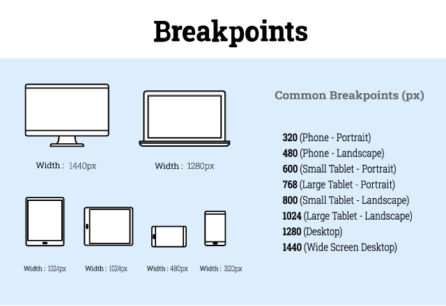

*** 
<details>
  <summary markdown="span"> Responsive Design Topics 📁  </summary>

1. Introduction to Responsive Design.<a href="Rushikesh_CSS_Resp.md">👉</a>
2. Responsive Design Breakpoints.<a href="#Break">👇</a>
3. Media Queries.<a href="Rushikesh_CSS_MediaQ.md">👉</a>

</details>

***


<p align ="left">

Breakpoints are points to determine when to change the Content, Layout of the Web and adapt the new rules Defined in the media queries.
    
</p>

***

<P align="center" id="Break"><b><i>Topic : CSS Breakpoints. </i><b></p>
  
***

✔️ Introduction  - 

- In responsive design, a breakpoint is a point at which the content of the Website and design will change/adapt in a certain way.
- Which provides the best user experience. 
- Breakpoints are pixel values, those are defined in CSS by Designer/Developer.
- A transformation occurs,  When a responsive website reaches those pixel values.
- Media Queries are used for applying Breakpoints.<i> More about Media Query.</i> <a href="Rushikesh_CSS_MediaQ.md">👉</a>

***


✔️ Adding Breakpoints  - 
1. Always design and Develop for Mobile-First.
2. Prioritize very important menu options.
3. Remove anything unnecessary and visually distracting.
4. Use of  Media Queries -
   - Research on most commonly used devices and screen size of those devices.
   - Hide and Display Certain elements at certain Breakpoints.
   - <i> More about Media Query.</i> <a href="Rushikesh_CSS_MediaQ.md">👉</a>

***
<P align="center"><b><i>Most Common Breakpoints -</i><b></p>

<P align="center"></p>


***


<p aligh="left">
  
- Additional Information -
  - 🔗  CSS Official [Website.](https://www.w3.org/Style/CSS/)
  - 🔗 [ CSS Box-Model.](https://www.w3.org/TR/CSS22/box.html)
  - 🔗 [CSS Media Queries.](https://www.w3.org/TR/css3-mediaqueries/)
   - 🔗 MDN Web Docs- [Media queries.](https://developer.mozilla.org/en-US/docs/Web/CSS/Media_Queries/Using_media_queries)

***
<br>
<br>
<br>
<br>
<br>
<br>

*** 
<details>
  <summary markdown="span"> Responsive Design Topics 📁  </summary>

1. Introduction to Responsive Design.<a href="Rushikesh_CSS_Resp.md">👉</a>
2. Responsive Design Breakpoints.<a href="Rushikesh_CSS_BreakResp.md">👉</a>
3. Media Queries.<a href="#Media">👇</a>

</details>

***


<p align ="left">

A Media query is a CSS3 feature. Using Media Query, A webpage can adapt its layout to different screen sizes and media types.
    
</p>

***

<P align="center" id="Media"><b><i>Topic : CSS Media Query. </i><b></p>
  
***

✔️ Introduction  - 

- Media queries introduced in CSS 3.
- It uses `@media` rule to Apply Certain CSS properties only if a Given condition is true.
- Breakpoints are defined using Media Queries. 
- Breakpoints are pixel values, those are defined in CSS by Designer/Developer.
- A transformation occurs,  When a responsive website reaches those pixel values.


***


✔️ Applying Media Queries  - 

1. First, define media queries with `@media` rule then include CSS rules inside the curly braces.
2. The `@media` rule used to specify CSS rules and target media types.

```css

@media () {
  // CSS rules
}

```
2. Media Types -
   - All  -  for all media types.
   - print  -  for Printers only.
   - screen -  for Computer screens, tablets and, Mobile Devices.
   - Speech - for Screen Readers.
3. Before Defining Breakpoints -
   - Research on most commonly used Devices and screen size of those Devices.
   - <i> More about Breakpoints.</i> <a href="Rushikesh_CSS_BreakResp.md">👉</a>

***
Example -

In CSS File -

```CSS
      * {
            box-sizing: border-box;
        }
        
        body {
            background: linear-gradient(to right, #91EAE4, #86A8E7, #7F7FD5);
        }
        
        .left {
            float: left;
            width: 50%;
        }
        
        .right {
            padding: 20px;
            float: left;
            width: 50%;
            align-items: center;
            height: 400px;
            text-align: center;
            color: white;
        }


        /* Media Query for mobile */
        
        @media screen and (max-width:600px) {
            .left,
            .right {
                width: 100%;
            }
        } 
```

In Html Body -

```html
  <div class="left">
        
    </div>
    <div class="right ">
        <h1>Web Development</h1>
        <h3><i>Things you need to learn - </i></h3>
        <p>HTML</p>
        <p>CSS</p>
        <p>Javascript</p>
        <p>PHP</p>
        <p>SQL</p>
        <p>CMS</p>
        <p></p>
        <p>Domain & Hosting</p>
    </div>
```


Output For Desktop -

<P align="center"></p>
Output For Mobile -
<P align="center"></p>


***


<p aligh="left">
  
- Additional Information -
  - 🔗  CSS Official [Website.](https://www.w3.org/Style/CSS/)
  - 🔗 [ CSS Box-Model.](https://www.w3.org/TR/CSS22/box.html)
  - 🔗 [CSS Media Queries.](https://www.w3.org/TR/css3-mediaqueries/)
   - 🔗 MDN Web Docs- [Media queries.](https://developer.mozilla.org/en-US/docs/Web/CSS/Media_Queries/Using_media_queries)

***
